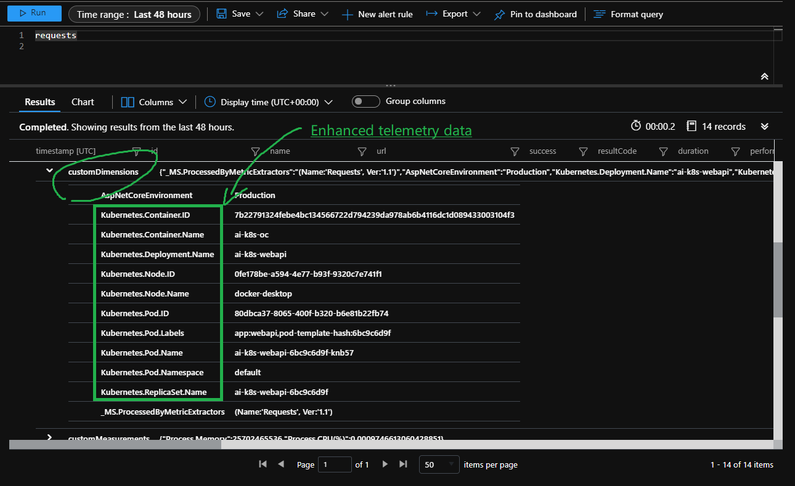

# Microsoft Application Insights for Kubernetes

[](https://www.nuget.org/packages/Microsoft.ApplicationInsights.Kubernetes/)
[](https://www.nuget.org/packages/Microsoft.ApplicationInsights.Kubernetes/)

This repository has code for Application Insights for Kubernetes, which works on .NET Core/.NET 6 applications within the containers, managed by Kubernetes, on Azure Container Service.



**Note:** `Microsoft Application Insights for Kubernetes` (this library) is an enhancement to the [Microsoft Application Insights](https://github.com/Microsoft/ApplicationInsights-aspnetcore). You can choose to run **Application Insights** without this library in Kubernetes cluster too. However, when using `Microsoft Application Insights for Kubernetes`, you will see Kubernetes related properties like *Pod-Name, Deployment ...* on all your telemetry entries. Proper values will also be set to make use of the rich features like enabling the Application Map to show the multiple micro services on the same map.

## Continuous Integration Status

| Rolling Build                                                                                                                           | Nightly Build                                                                                                                           |
| --------------------------------------------------------------------------------------------------------------------------------------- | :-------------------------------------------------------------------------------------------------------------------------------------- |
|  |  |

## Get Started

This is a quick guide for ASP.NET Core project. For [Worker Services in .NET](https://docs.microsoft.com/en-us/dotnet/core/extensions/workers), refer to [Application Insights Kubernetes Example (Worker)](./examples/WorkerExample/Readme.md).

### Prerequisite

* [Application Insights for ASP.NET Core](https://github.com/Microsoft/ApplicationInsights-aspnetcore)
* [Docker Containers](https://www.docker.com/)
* [Kubernetes](https://kubernetes.io/)

### Instrument an ASP.NET Core application

These are the basic steps to instrument an ASP.NET Core application to enable Application Insights for Kubernetes. You will need to run the application in containers managed by Kubernetes to see the change.

1. Add reference to **Application Insights SDK** and **Application Insights for Kubernetes**:

    ```shell
    dotnet add package Microsoft.ApplicationInsights.AspNetCore
    dotnet add package Microsoft.ApplicationInsights.Kubernetes
    ```

1. Enable **Application Insights** and **Application Insights for Kubernetes Enricher** in `Startup.cs`:

    ```csharp
    public void ConfigureServices(IServiceCollection services)
    {
        ...
        services.AddApplicationInsightsTelemetry("----Your Application Insights Instrumentation Key ----");
        services.AddApplicationInsightsKubernetesEnricher();
        services.AddMvc();
        ...
    }
    ```

1. Build the application in containers, then deploy the container with Kubernetes.

**Notes:** Those steps are not considered the best practice to set the instrumentation key for application insights. Refer to [Enable Application Insights server-side telemetry](https://docs.microsoft.com/en-us/azure/azure-monitor/app/asp-net-core#enable-application-insights-server-side-telemetry-without-visual-studio) for various options. Also, consider deploy Kubernetes Secrets to secure it.

### Walk-through

Both **ASP.NET Core** and **.NET Core** applications are supported.

* For **ASP.NET Core** Application: Refer to [Getting Started](https://github.com/Microsoft/ApplicationInsights-Kubernetes/wiki/Getting-Started-for-ASP.NET-Core-Applications) for a simple walk-through.

* For **.NET Core** Application: Refer to [Getting Started](examples/BasicConsoleAppILogger/README.md) for a simple walk-through.

* Follow [this example](examples/BasicUsage_clr21_RBAC) for **Role-based access control (RBAC)** enabled Kubernetes clusters.

### Configuration Details

Customize configurations are supported starting with version 1.0.2 of the ApplicationInsights.Kubernetes package. There are several ways to customize the settings. For example:

1. Using code:

    ```csharp
    services.AddApplicationInsightsKubernetesEnricher(option=> {
        option.InitializationTimeout = TimeSpan.FromSeconds(15);
    });
    ```

2. Using `appsettings.json`:

    ```jsonc
    {
        "Logging": {
            // ...
        },
        // Adding the following section to set the timeout to 15 seconds
        "AppInsightsForKubernetes": {
            "InitializationTimeout": "00:00:15"
        }
    }
    ```

3. Using environment variables:

    ```shell
    AppInsightsForKubernetes__InitializationTimeout=3.1:12:15.34
    ```

    All the related configurations have to be put in a section named `AppInsightsForKubernetes`. The supported keys/values are listed below:

    | Key                   | Value/Types | Default Value | Description                                                                                  |
    | --------------------- | ----------- | ------------- | -------------------------------------------------------------------------------------------- |
    | InitializationTimeout | TimeSpan    | 00:02:00      | Maximum time to wait for spinning up the container. Accepted format: [d.]hh:mm:ss[.fffffff]. |
    | DisablePerformanceCounters | Boolean     | false         | Sets to true to avoid adding performance counter telemetry initializer.                      |

The configuration uses the ASP.NET Core conventions. Refer to [Configuration in ASP.NET Core](https://docs.microsoft.com/en-us/aspnet/core/fundamentals/configuration/?view=aspnetcore-2.1) for more information.

### Verify the cluster configuration (Linux Container only)

Use the [troubleshooting image](https://github.com/Microsoft/ApplicationInsights-Kubernetes/tree/develop/troubleshooting) to verify the cluster is properly configured.

### Learn more

* To build a container for Kubernetes that have Application Insights baked in for the existing applications, please refer the example of [Zero Code light up](https://github.com/Microsoft/ApplicationInsights-Kubernetes/tree/develop/examples/ZeroUserCodeLightup).
* To enable diagnostic logs when Application Insights for Kubernetes doesn't work as expected, reference [How to enable self diagnostics for ApplicationInsights.Kubernetes](docs/SelfDiagnostics.MD).
* Still want more? Read the [Wikis](https://github.com/Microsoft/ApplicationInsights-Kubernetes/wiki).

### Next step

Profile your application for performance improvement using [Application Insights Profiler for Linux](https://github.com/Microsoft/ApplicationInsights-Profiler-AspNetCore).

## Contributing

### Report issues

Please file bug, discussion or any other interesting topics in [issues](https://github.com/Microsoft/ApplicationInsights-Kubernetes/issues) on GitHub.

### Troubleshooting

Read the [FAQ](https://github.com/microsoft/ApplicationInsights-Kubernetes/wiki/FAQ) for common issues. When Microsoft.ApplicationInsights.Kubernetes doesn't work properly, you can turn on self-diagnostics to see the traces in Kubernetes' logs. Refer to [How to enable self diagnostics for ApplicationInsights.Kubernetes](./docs/SelfDiagnostics.MD) for instructions.

### Developing

Please refer the [Develop Guide](https://github.com/Microsoft/ApplicationInsights-Kubernetes/wiki/Development-Guide).

---
This project has adopted the [Microsoft Open Source Code of Conduct](https://opensource.microsoft.com/codeofconduct/). For more information see the [Code of Conduct FAQ](https://opensource.microsoft.com/codeofconduct/faq/) or contact [opencode@microsoft.com](mailto:opencode@microsoft.com) with any additional questions or comments.