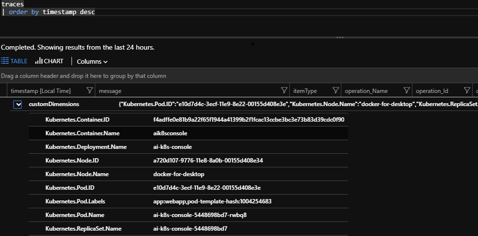

# Enable Application Insights for Kubernetes in .NET Core Console Application

When running a Console Application inside a Kubernetes managed container, and if you have chosen Application Insights as your telemetry solution, you might want to enrich the telemetry with Kubernetes related information. This is an example of how to do it.

_Note: This is an example that does not follow all best practices, including security-related best practices. E.g. Application Insights instrumentation key is not adequately protected (it should be deployed as a secret)._

## Prerequisites

* .NET Core SDK 2.1.300 or above

Run `dotnet --version` to figure out the dotnet sdk version:

```shell
dotnet --version
```

The result is the SDK version, for example:
> 2.2.101

* A Kubernetes cluster that you can manage with kubectl

  * If you don't have one yet, an easy way is to go to [Azure AKS](https://docs.microsoft.com/en-us/azure/aks/) to get a managed cluster.
  * Verify that the credential is properly set for `kubectl` to work:

  ```shell
  user@user-pc:~$ kubectl get nodes
  NAME                       STATUS    ROLES     AGE       VERSION
  aks-nodepool1-10984277-0   Ready     agent     17d       v1.9.9
  user@user-pc:~$
  ```

* A container registry

  * The image built will be pushed into an image repository. Dockerhub is used in this example.

## Walk-through

### Creates a Console Application

```shell
dotnet new console -n AiK8sConsole
```

__Tips:__ find a complete example in [src](./src).

### Adds the NuGet packages

Add the Application Insights packages:

```shell
dotnet add package Microsoft.ApplicationInsights
dotnet add package Microsoft.ApplicationInsights.Kubernetes
```

In this example, we are planning to put application insights key in the environmental variable, we are adding the following package too:

```shell
dotnet add package Microsoft.Extensions.Configuration.EnvironmentVariables
```

### Write the code to enable Application Insights

Follow the example code in [Program.cs](./src/Program.cs) to enable application insights with Kubernetes information on the telemetries. The key lines are:

Enable application insights by creating the configuration:

  ```csharp
  TelemetryConfiguration configuration = new TelemetryConfiguration(iKey);
  ```

And then enable the enricher for Kubernetes info:

  ```csharp
  configuration.AddApplicationInsightsKubernetesEnricher(applyOptions: null);
  ```

Starts build the client and then send the trace every once a while:

  ```csharp
  TelemetryClient client = new TelemetryClient(configuration);
  while (true)
  {
      client.TrackTrace("Hello from AI SDK");
      client.Flush();
      Thread.Sleep(30000);
  }
  ```

### Build & Publish the container

Once the application is there, we can containerize it. Use [Dockerfile](./src/Dockerfile) as a reference and call the docker CLI to build it:

```shell
docker build -t dockeraccount/aik8sconsole .
```

Publish the image to the registry:

```shell
docker publish dockeraccount/aik8sconsole:latest
```

### Setup the default Service Account for RBAC enabled cluster

If the cluster is RBAC enabled, the service account used will need to bind to proper cluster role so that the application can fetch Kubernetes related properties. In [saRole.yaml](./src/saRole.yaml), a cluster role named appinsights-k8s-property-reader is created and then bind to the default service account. Permissions needed are listed in the resources property. To deploy it, update the value for the namespace and then:

```shell
kubectl create -f saRole.yaml
```

### Deploy the application

Create the Kubernetes spec for the deployment and the service. Referencing [k8s.yaml](src/k8s.yaml). Please update the variable of APPINSIGHTS_INSTRUMENTATIONKEY to your own application insights instrumentation key.

### Deploy the container to the cluster

```shell
kubectl create -f k8s.yaml
```

### Verification

Once properly set up, your telemetry data will all be decorated with Kubernetes properties on it:


