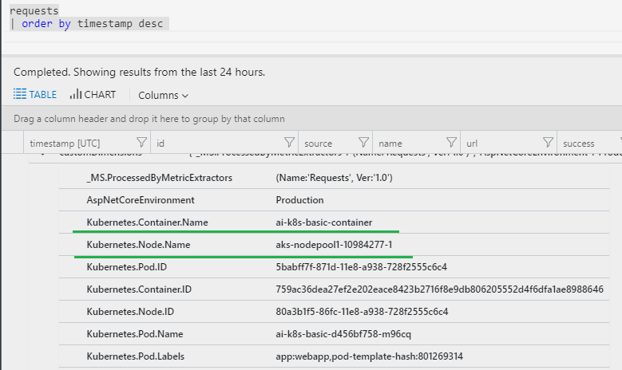

# Walkthrough
This example walks through the steps to deploy an ASP.NET Core 2.1 MVC application to a Kubernets cluster with `Application Insights for Kubernetes` on.

A simple cluster role sample yaml is also included to describe how to make it work in a Role-based access control(RBAC) enabled clusters.

_Tip: [Read this for more information about RBAC](https://kubernetes.io/docs/reference/access-authn-authz/rbac/)._

_Note: This is an example that does not follow all best practices, including security-related best practices. E.g. Application Insights instrumentation key is not adequately protected (it should be deployed as a secret)._

## Prerequisite
* .NETCore SDK 2.1.300 or above

  * .NET Core SDK is required in this example. Go to [https://dot.net](https://dot.net) to download the latest SDK. Make sure you have `2.1.300` or `above`:
    ```bash
    dotnet --version
    2.1.301
    ```
* A Kubernetes Cluster that you can manage with kubectl.
  * If you don't have any, an easy way is to go to [Azure AKS](https://docs.microsoft.com/en-us/azure/aks/) to get a managed cluster. Verify that the credential is properly set for kubctl to work:
    ```bash
    user@user-pc:~$ kubectl get nodes
    NAME                       STATUS    ROLES     AGE       VERSION
    aks-nodepool1-10984277-0   Ready     agent     17d       v1.9.9
    aks-nodepool1-10984277-1   Ready     agent     17d       v1.9.9
    aks-nodepool1-10984277-2   Ready     agent     17d       v1.9.9
    user@user-pc:~$
    ```
* A container image repository
  * The image built will be pushed into an image repository. Dockerhub is used in this example.

## Create the project
* Let's start by creating an ASP.NET Core MVC applicaiton:
```
dotnet new mvc
```
* Add the NuGet Packages:
```
dotnet add package Microsoft.ApplicationInsights.AspNetCore
dotnet add package Microsoft.ApplicationInsights.Kubernetes --version 1.0.0-*
```

* Enable Application Insights in Program.cs by calling UseApplicaitonInsights() on WebHostBuilder:
```csharp
public static IWebHost BuildWebHost(string[] args) =>
    WebHost.CreateDefaultBuilder(args)
        .UseApplicationInsights()  // Add this line of code
        .UseStartup<Startup>()
        .Build();
```
* Enable Application Insights for Kubernetes in Startup.cs:
```csharp
public void ConfigureServices(IServiceCollection services)
{
    services.EnableKubernetes();  // Add this line of code
    services.AddMvc().SetCompatibilityVersion(CompatibilityVersion.Version_2_1);
}
```

## Prepare the container
* It is always recommended to update the base images:
```
docker pull microsoft/dotnet:2.1-sdk
docker pull microsoft/dotnet:2.1-aspnetcore-runtime
```
* Add [Dockerfile](app/Dockerfile) to the project folder. Build the docker container (dockeraccount/aik8sbasic_rbac, for example) using [Dockerfile](app/Dockerfile) and upload it to an image registry.
```
docker build . -t dockeraccount/aik8sbasic_rbac:latest
docker push dockeraccount/aik8sbasic_rbac:latest
```
## Setup the default Service Account for RBAC enabled cluster
* If the cluster is RBAC enabled, the service account used will need to bind to proper cluster role so that the application can fetch Kubernetes related properties.
In [saRole.yaml](k8s/saRole.yaml), a cluster role named `metrics-reader` is created and then bind to the default service account. Permissions needed are listed in the resources property. To deploy it, update the value for the `namespace` and then:
```
kubectl create -f k8s/saRole.yaml
```

## Deploy the application
*  Create the Kubernetes spec for the deployment and the service. Referencing [k8s.yaml](k8s/k8s.yaml). Please update the variable of `APPINSIGHTS_INSTRUMENTATIONKEY` to your own application insights instrumentation key.
Deploy it:
```
kubectl create -f k8s/k8s.yaml
```

## Verification
Once properly set up, your telemetry data will all be decorated with Kubernetes properties on it:



## Next step
* [Troubleshoot Application Insights for Kubernetes](https://github.com/Microsoft/ApplicationInsights-Kubernetes/wiki/%5BAdvanced%5D-How-to-enable-self-diagnostics-for-ApplicationInsights.Kubernetes)

* [Enable Application Insights Profiler](https://github.com/Microsoft/ApplicationInsights-Profiler-AspNetCore) to optimize the performance for your application.