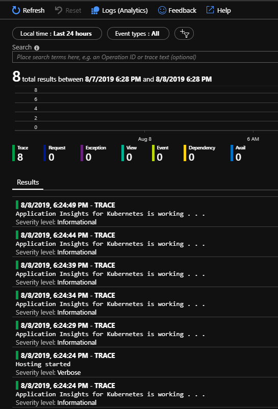

# Use Application Insights for Kubernetes in .NET Generic Host project

This is an example of enabling Application Insights for Kubernetes in .NET Generic Host project. If you are looking into enabling profiler on a plain Console Application, refer to [Enable Application Insights for Kubernetes in .NET Core Console Application](../BasicConsoleAppILogger/Readme.md).

## Why .NET Generic Host

According to [.NET Generic Host](https://docs.microsoft.com/en-us/aspnet/core/fundamentals/host/generic-host?view=aspnetcore-2.2):

> "The purpose of Generic Host is to decouple the HTTP pipeline from the Web Host API to enable a wider array of host scenarios. Messaging, background tasks, and other non-HTTP workloads based on Generic Host benefit from cross-cutting capabilities, such as configuration, dependency injection (DI), and logging."

And also notice:
> Generic Host is new in ASP.NET Core 2.1 and isn't suitable for web hosting scenarios. For web hosting scenarios, use the Web Host. Generic Host will replace Web Host in a future release and act as the primary host API in both HTTP and non-HTTP scenarios.

Now that you know what the .NET Generic Host is used for, lets dive in.

## Walk-through

### Create an empty console app

```bash
dotnet new console -n AIK8sGenericHost
```

### Adding necessary packages

```bash
dotnet add package Microsoft.Extensions.Hosting
dotnet add package Microsoft.Extensions.DependencyInjection
dotnet add package Microsoft.Extensions.Logging.ApplicationInsights
dotnet add package Microsoft.Extensions.Logging.Console
```

Reference to [AIK8sGenericHost.csproj](./src/AIK8sGenericHost.csproj) for the final results.

### Set up a host

```csharp
using System.Threading.Tasks;
using Microsoft.Extensions.Hosting;

namespace AIK8sGenericHost
{
    class Program
    {
        public static async Task Main(string[] args)
        {
            var host = new HostBuilder()
                .Build();

            await host.RunAsync();
        }
    }
}
```

### Enable Application Insights and its Kubernetes enricher

```csharp
            var host = new HostBuilder()
                .ConfigureServices((context, services) =>
                {
                    var channel = new InMemoryChannel();

                    // Add application insights for Kubernetes. Making sure this is called before services.Configure<TelemetryConfiguration>().
                    services.AddApplicationInsightsKubernetesEnricher();

                    services.Configure<TelemetryConfiguration>(
                        (config) =>
                        {
                            config.TelemetryChannel = channel;
                        }
                    );

                    // Add the logging pipelines to use. We are using Application Insights only here.
                    services.AddLogging(builder =>
                        {
                            // Optional: Apply filters to configure LogLevel Trace or above is sent to
                            // Application Insights for all categories.
                            builder.AddFilter<Microsoft.Extensions.Logging.ApplicationInsights.ApplicationInsightsLoggerProvider>
                                                            ("", LogLevel.Trace);
                            builder.AddApplicationInsights("--YourAIKeyHere--");
                        });

                    // Register your services that implemented IHostedService interface. For example, SendAIEventService. You will need to uncomment this later.
                    // services.AddHostedService<SendAIEventService>();
                }).Build();
```

Largely, those implementations come from [ApplicationInsightsLoggerProvider for .NET Core ILogger logs](https://docs.microsoft.com/en-us/azure/azure-monitor/app/ilogger).

### Create a hosted service

Refer to [SendAIEventService](./src/SendAIEventService.cs) for the implementation.

Now that the service is created, it could be registered into the dependency injection container:

```csharp
// Register your services that implemented IHostedService interface. For example, SendAIEventService.
services.AddHostedService<SendAIEventService>();
```

### Flush the channel with lifetime methods

Since the telemetry won't necessary be flushed, we should flush the channel at the end of the life cycle of the host.
One way of doing that is to register to the application lifetime:

```csharp
            IApplicationLifetime lifetime = host.Services.GetRequiredService<IApplicationLifetime>();
            lifetime.ApplicationStopping.Register(() =>
            {
                channel.Flush();
                // Work around Application Insights issue:
                // https://github.com/Microsoft/ApplicationInsights-dotnet/issues/407
                System.Threading.Thread.Sleep(TimeSpan.FromSeconds(2));
            });
```

### Containerize the application

* Create a docker file like [this](./src/Dockerfile).
* Build and push the images:

```bash
docker build -t dockeraccount/aik8sgenerichost .
docker push dockeraccount/aik8sgenerichost:latest
```

### Deploy it to Kubernetes

* Create a Kubernetes deployment file like [this](./src/K8s.yaml).
* Deploy it:

```bash
kubectl create -f K8s.yaml
```

For RBAC enabled Kubernetes cluster (AKS for example), you will need to have proper service account bindings. Refer to [here](../BasicUsage_clr21_RBAC/README.MD#setup-the-default-service-account-for-rbac-enabled-cluster) to see how to do it.

### Result

Go to the application insights and you will see traces with kubernetes properties.



## References

* [.NET Generic Host](https://docs.microsoft.com/en-us/aspnet/core/fundamentals/host/generic-host?view=aspnetcore-2.2)
* [USING HOSTBUILDER AND THE GENERIC HOST IN .NET CORE MICROSERVICES](https://www.stevejgordon.co.uk/using-generic-host-in-dotnet-core-console-based-microservices)
* [ApplicationInsightsLoggerProvider for .NET Core ILogger logs](https://docs.microsoft.com/en-us/azure/azure-monitor/app/ilogger)
  * Specifically, [Console application](https://docs.microsoft.com/en-us/azure/azure-monitor/app/ilogger#console-application) part.
