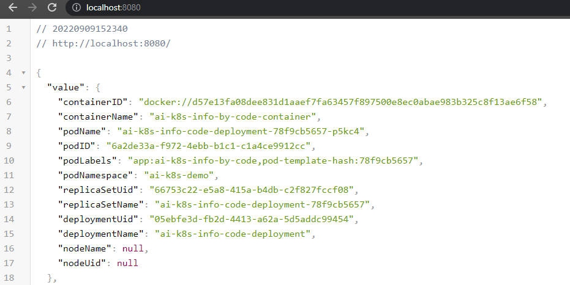

# Access Kubernetes Cluster Info by Your Code

Starting from `Microsoft.ApplicationInsights.Kubernetes 3.0`, it is possible to access Kubernetes cluster information by code. This is an example of how to do it.

## Prerequisite

Your application is running inside the Kubernetes Cluster with Microsoft.ApplicationInsights.Kubernetes configured correctly.

There are some examples to help you get started:
  * [Application Insights for Kubernetes on WebAPI](../WebAPI.Net6/Readme.md)
  * [Application Insights Kubernetes Example (Worker)](../WorkerExample/Readme.md)

## Access the service

The Kubernetes cluster properties are exposed through [IK8sService](../../src/ApplicationInsights.Kubernetes/IK8sInfoService.cs) interface.

The registration is done in the extension method of `AddApplicationInsightsKubernetesEnricher()`. You should have already called it like:

```csharp
builder.Services.AddApplicationInsightsKubernetesEnricher(diagnosticLogLevel: LogLevel.Information);
```

To access the service, use dependency injection. For example:

```csharp
// Inject IK8sInfoService to use k8s info.
app.MapGet("/", ([FromServices] IK8sInfoService k8SInfoService) =>
{
    if (k8SInfoService.TryGetK8sInfo(out IK8sEnvironment? k8sInfo))
    {
        // When getting the info success, k8sInfo object is ready for consumption.
        Console.WriteLine(k8sInfo);
    }
    else
    {
        // The k8s info is not there.
        Console.WriteLine("No k8s info. Am I running inside a k8s cluster?");
    }
    return new OkObjectResult(k8sInfo);
});
```

For a full example, refer to [Program.cs](./Program.cs).

The code above would return the `k8sInfo` in the controller, so when you deployed the code to a Kubernetes cluster, the response would look like this:



When running outside the Kubernetes cluster, `k8sInfo` would be null.

## Build a docker image for this example

Since there's no public package that supports the functionality, binaries are built locally first, then the container.

* Publish binaries in release configuration

  ```csharp
  dotnet publish -c Release
  ```

* Define some variables

  ```shell
  $containerName = 'ai-k8s-info-by-code'   # Tweak this accordingly. Check the content in k8s.yaml to match it.
  $dockeraccount = ''                      # Container registry account used to upload the container
  $containerAppName = "$containerName-app"

  ```

* Build the container

  ```shell            
  docker build -t "$containerName" .
  ```
  Check out the [dockerfile](./dockerfile) to see how is it built.

* To run a local test (out of a K8s cluster)

  ```shell
  docker container rm $containerAppName -f # Making sure any existing container with the same name is deleted
  docker run -d -p 8080:80 --name "$containerAppName" "$containerName"
  docker logs "$containerAppName"
  ```

  Expect to see an error like this:
    
  >[Error] [2022-09-09T23:04:06.4803528Z] Application is not running inside a Kubernetes cluster.
  
  
  And if you invoke the endpoint, `curl http://localhost:8080` for example, it will return an Ok result with an empty value.

* Delete the running instance once the local test is done

  ```shell
  docker container rm $containerAppName -f
  ```

Once you have the image, everything else remains the same.