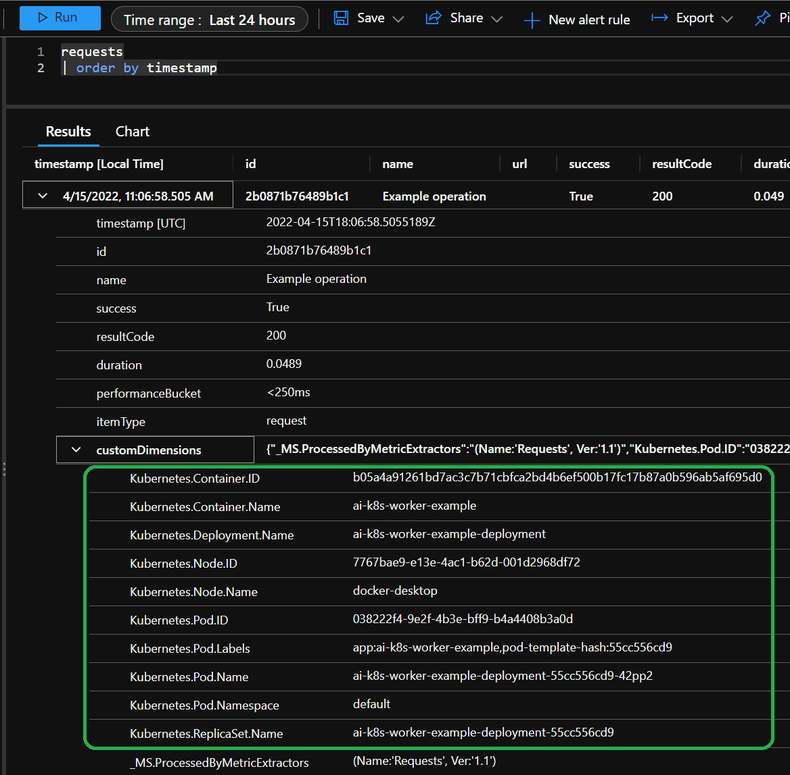
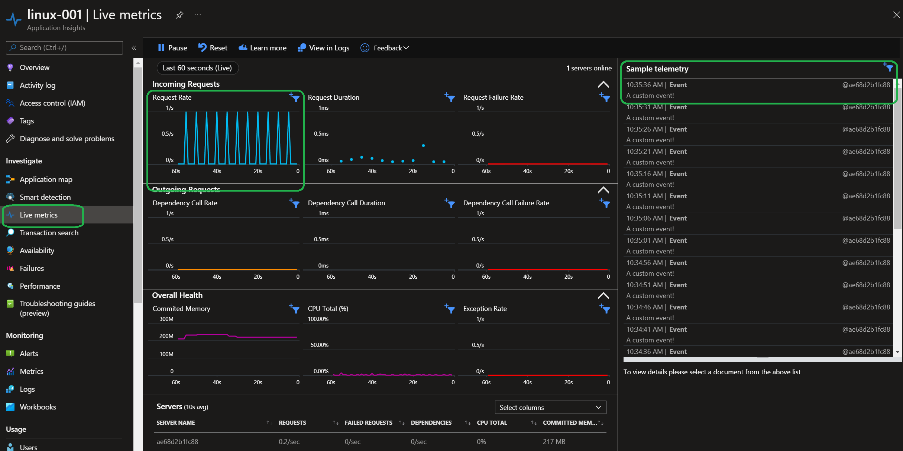
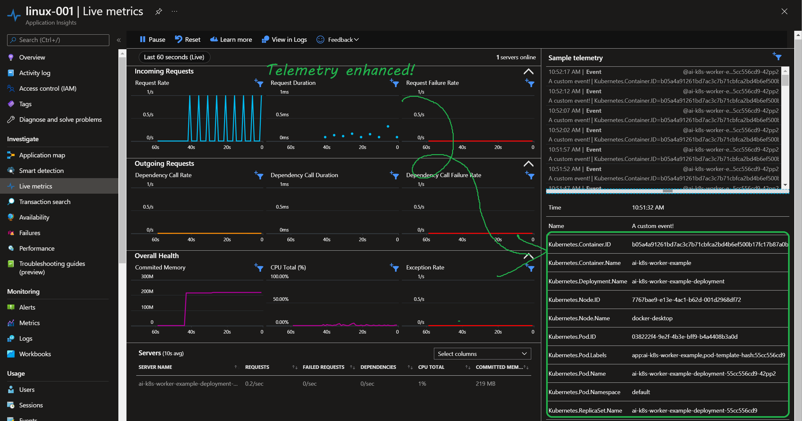

# Application Insights Kubernetes Example (Worker)

This is an example of how to use `ApplicationInsights.Kubernetes` inside a worker. The project uses .NET 6, it should work in .NET Core 3.1 with minimal tweaks.

## Goal

This is what it looks like when `ApplicationInsights.Kubernetes` is turned on for your worker application:



And this example will walk you through the key steps.

## Prerequisite

* .NET 6 SDK if you haven't yet. Refer to <https://dot.net> for more details.
* [DockerDesktop](https://www.docker.com/products/docker-desktop/).
    * For building docker image.
    * For running a local Kubernetes Cluster.
* [An application insights resource](https://docs.microsoft.com/en-us/azure/azure-monitor/app/create-new-resource) for testing the result.
* A clone/fork this repo.
    * Navigate to example folder of: examples/WorkerExample.

## How is the application built

* Refer to [WorkerExample.csproj](./WorkerExample.csproj) for NuGet packages needed. Here's a copy:

    ```xml
    <PackageReference Include="Microsoft.ApplicationInsights.Kubernetes" Version="2.0.2" />
    <PackageReference Include="Microsoft.ApplicationInsights.WorkerService" Version="2.20.0" />
    <PackageReference Include="Microsoft.Extensions.DependencyInjection" Version="6.0.0" />
    <PackageReference Include="Microsoft.Extensions.Hosting" Version="6.0.1" />
    ```

* Add a [Worker](./Worker.cs) class. Notes:
    * It inherits from `BackgroundService`.
    * It injects `TelemetryClient`.
    * It sends one `request operation` and one `custom event` to application insights every 5 seconds.

* Refer to [Program.cs](./Program.cs) for setup the worker as a generic host. Here are the critical services to register:

    ```csharp
    services.AddApplicationInsightsTelemetryWorkerService();    // Enable Application Insights for workers.
    services.AddApplicationInsightsKubernetesEnricher();        // Enable Application Insights Kubernetes to enhance telemetries.
    services.AddHostedService<Worker>();                        // Register the background service of Worker.
    ```

* Making sure `appsettings.json` will be copied to output folder on build, pay attention to the build task in the project file like this:
    ```xml
    <ItemGroup>
        <!-- Build action is `None`, and the option for copy to output directory could be `Always` or `PreserveNewest` -->
        <None Include="./appsettings.json" CopyToOutputDirectory="PreserveNewest" />
    </ItemGroup>
    ```

    * Remember to update the connection string in `appsettings.json` when you try it on your own. You can get the connection string on the `Overview` blade of your application insights resource. Refer [Connection Strings](https://docs.microsoft.com/en-us/azure/azure-monitor/app/sdk-connection-string?tabs=net) for more details.
    * Using of instrumentation key instead of connection string should work too. You will need to setup `InstrumentationKey` than `ConnectionString` in `appsettings.json`.

## Build docker image

* Build the image

    ```shell
    docker build -t workerapp .
    ```

* Optionally run it locally

    ```shell
    docker run -d --name myapp workerapp
    docker logs myapp
    ```

    You will see logs like this:
    
    ```shell
    info: Microsoft.Hosting.Lifetime[0]
    Application started. Press Ctrl+C to shut down.
    info: Microsoft.Hosting.Lifetime[0]
        Hosting environment: Production
    info: Microsoft.Hosting.Lifetime[0]
        Content root path: /app
    ```

* Optionally, check out the `Live Metrics` in your application insights resource, you shall see request / custom events. 
    * This is primary used to verify that the application is properly instrumented with Application Insights for worker.
    * Since the application is not yet hosted in a Kubernetes cluster, there's no Kubernetes related property yet.

        

* Delete the container when the test is done

    ```shell
    docker rm myapp -f
    ```

## Push the image when it is ready

* Tag the image properly, for example:

    ```shell
    docker tag workerapp dockerhub_account_name/ai-k8s-worker-example:0.0.1
    ```

* Push the image:

    ```shell
    docker push dockerhub_account_name/ai-k8s-worker-example:0.0.1
    ```

## Deploy the container to K8s cluster

* Build a deployment yaml file, refer to [k8s.yml](./k8s.yml).

    * Update the image property to pointing to the one that you intend to use.

* Deploy it:

    ```shell
    kubectl create -f .\k8s.yml
    ```

    Now, check the live metrics again, you shall see enhanced telemetries:

    

* Clean up the deployment:

    ```shell
    kubectl delete -f .\k8s.yml
    ```

If you have ideas, feature requests or run into problems, feel free to file an [issue](https://github.com/microsoft/ApplicationInsights-Kubernetes/issues).

## References

* [Application Insights for Worker](https://docs.microsoft.com/en-us/azure/azure-monitor/app/worker-service#using-application-insights-sdk-for-worker-services)
* [.NET Generic Host](https://docs.microsoft.com/en-us/dotnet/core/extensions/generic-host)
* [Dockerize an ASP.NET Core application](https://docs.docker.com/samples/dotnetcore/)
* [Create An application insights resource](https://docs.microsoft.com/en-us/azure/azure-monitor/app/create-new-resource)
* [Use Connection Strings in Application Insights](https://docs.microsoft.com/en-us/azure/azure-monitor/app/sdk-connection-string?tabs=net)