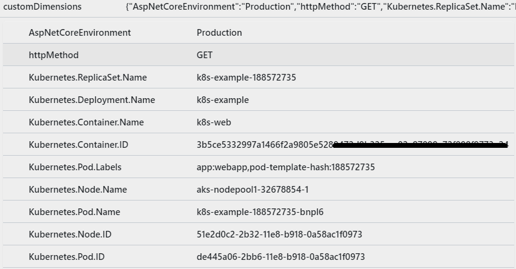

# Zero Code light up Example

This example shows how to enable application insights for Kubernetes for ASP.NET Core 6.x WebAPI without code change for the existing project.

## Add Dockerfile

All you need to do is to add a few lines in the [Dockerfile](./dockerfile), and they are:

```dockerfile
...
# Adding a reference to hosting startup package
RUN dotnet add package Microsoft.ApplicationInsights.Kubernetes.HostingStartup --prerelease

# Light up Application Insights for Kubernetes
ENV APPINSIGHTS_INSTRUMENTATIONKEY $APPINSIGHTS_KEY
ENV ASPNETCORE_HOSTINGSTARTUPASSEMBLIES Microsoft.ApplicationInsights.Kubernetes.HostingStartup
...
```

Reference the full [Dockerfile](./dockerfile).

*Note: To make your build context as small as possible add a [.dockerignore](./.dockerignore) file to your project folder.*

## Build and run the Docker image

1. Open a command prompt and navigate to your project folder.
1. Use the following commands to build and run your Docker image:

    ```shell
    docker build -t ai-k8s-app --build-arg APPINSIGHTS_KEY=YOUR_APPLICATION_INSIGHTS_KEY .
    docker container rm test-ai-k8s-app -f # Making sure any existing container with the same name is deleted
    docker run -d -p 8080:80 --name test-ai-k8s-app ai-k8s-app
    docker logs test-ai-k8s-app
    ```

1. Delete the running container after the verification is done:

    ```shell
    docker container rm test-ai-k8s-app -f
    ```


## Expect the error

If you follow the steps above, you shall see the following error in the beginning of the log:

```shell
[Warning] [2022-06-10T21:23:10.0412107Z] Application is not running inside a Kubernetes cluster.
```

Congratulations, your image is ready to run inside the Kubernetes! The warning, as a matter of fact, is a good sign that Application Insights for Kubernetes is injected and is trying to get the Kubernetes related data. It failed only because it is running outside of the Kubernetes.

## Upload the image to container registry

Once verified, the image is ready to be uploaded. Take docker hub for example, this works with any docker image registry:

```shell
docker tag ai-k8s-app:latest dockeraccount/ai-k8s-app:0.0.1
docker push dockeraccount/ai-k8s-app:0.0.1
```

**Note:** Change the tag properly. For more details, please reference the docker document: [Push images to Docker Cloud](https://docs.docker.com/docker-cloud/builds/push-images/).

## Deploy the application in Kubernetes

Now that the image is in the container registry, it is time to deploy it to Kubernetes. Create a Kubernetes deployment file. Reference [k8s.yaml](k8s.yaml) as an example, pay attention to the **image** and **environment variables**, making sure they are properly setup.

**Note:** There is yet another chance to overwrite the environment variable of the application insights key. [Secrets](https://kubernetes.io/docs/concepts/configuration/secret/) are recommended to protect the key in the production environment.

Then run the following kubectl command to deploy the app:

```bash
# kubectl create -f deployment.yaml
```

To learn more about Kubernetes deployment, please refer to [Deployments](https://kubernetes.io/docs/concepts/workloads/controllers/deployment/).

Generate some traffic to your application. After a while (around 2 minutes), you shall see Application Insights data coming with Kubernetes properties on it.



## Summary

In this example, we modified the Dockerfile a bit to add the required NuGet packages into the project, then we used the environment variables to enable the feature.
The environment variable could also be managed by Kubernetes in the deployment spec.

Please also consider to protect the application insights instrumentation key by using various meanings, for example, by using the [Secrets](https://kubernetes.io/docs/concepts/configuration/secret/).
